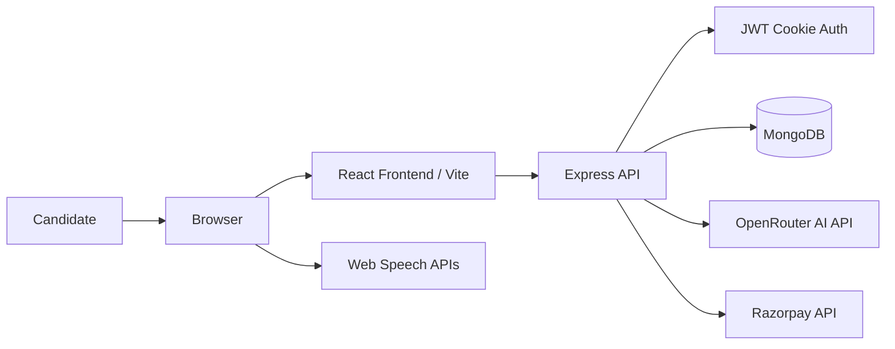

# InterviewIQ Architecture

## 1. Overview

InterviewIQ is a full-stack mock interview platform designed for job seekers to practice interviews, upload resumes, answer AI-generated questions, and review performance reports. The application is organized as a monorepo with a client application and an API server, backed by MongoDB and integrated with AI and payment providers.

The current implementation follows a layered architecture:

- Frontend: React + Vite SPA for the user experience
- Backend: Express API for auth, interviews, reports, and payments
- Persistence: MongoDB via Mongoose
- AI: OpenRouter Chat Completions API
- Payments: Razorpay
- Browser capabilities: speech synthesis and speech recognition for interview flow

## 2. High-Level System View



## 3. Runtime Architecture

### 3.1 Client Runtime

The frontend is built with React and Vite in the `client/` folder. It uses:

- `react-router-dom` for page routing
- Redux Toolkit for app state (`userSlice`)
- Axios for backend communication
- Tailwind-based styling and motion animations
- PDF export via `jspdf` and `jspdf-autotable`
- Recharts and circular progress indicators for analytics

Key pages:

- `client/src/pages/Home.jsx` — marketing landing page and entry points
- `client/src/pages/Auth.jsx` — authentication flow
- `client/src/pages/InterviewPage.jsx` — orchestrates the three-step interview flow
- `client/src/pages/InterviewHistory.jsx` — shows interview history
- `client/src/pages/InterviewReport.jsx` — detailed interview report screen
- `client/src/pages/Pricing.jsx` — credit purchase plans

The interview experience is composed of:

- `Step1SetUp`: role, experience, mode, optional resume upload
- `Step2Interview`: question playback, microphone capture, timer, answer submission, feedback
- `Step3Report`: aggregated score display, charts, and PDF export

### 3.2 Server Runtime

The backend is built with Express and runs from `server/index.js`.

It registers these API groups:

- `/api/auth` — Google login and logout
- `/api/user` — current-user lookup
- `/api/interview` — resume analysis, question generation, answer submission, report retrieval
- `/api/payment` — Razorpay order creation and signature verification

The server uses:

- `cors` for browser-to-server cross-origin configuration
- `cookie-parser` for reading JWT cookies
- `express.json()` for JSON payloads
- `multer` for temporary resume upload storage
- Mongoose for MongoDB access

### 3.3 Security and Identity Layer

Authentication is implemented with a signed JWT and an HTTP-only cookie:

- `server/config/token.js` generates JWTs using the user ID
- `server/middlewares/isAuth.js` verifies the token from cookies
- `req.userId` is attached to the request for downstream authorization checks
- the cookie is set with `httpOnly`, `sameSite: "strict"`, and a 7-day expiry

This pattern keeps the auth token out of JavaScript-accessible storage and enforces authentication on protected routes.

## 4. Core Business Flows

### 4.1 User Authentication Flow

1. User signs in through Google.
2. Backend receives the user’s name and email.
3. If the email is new, a `User` document is created.
4. A JWT is generated and saved in an HTTP-only cookie.
5. The server returns the authenticated user document.
6. The frontend stores that user in Redux and uses it for navigation and credit state.

### 4.2 Resume Analysis Flow

1. User uploads a PDF from the setup screen.
2. The backend receives the file through Multer.
3. It reads the PDF with `pdfjs-dist`.
4. Resolved text is passed to the AI service.
5. The AI returns structured JSON with inferred role, experience, skills, and projects.
6. The frontend pre-fills the interview form.
7. The temporary uploaded file is deleted after use.

### 4.3 Interview Generation Flow

1. The user enters role, experience, and mode.
2. The frontend submits a request to `/api/interview/generate-questions`.
3. The backend checks the authenticated user and credit balance.
4. A minimum of 50 credits is required.
5. The server deducts 50 credits and creates an `Interview` record.
6. The AI service generates exactly five questions in a progressive difficulty order.
7. The server returns the interview ID and the question list.

### 4.4 Interview Execution Flow

1. Each question is read aloud using browser speech synthesis.
2. The browser microphone captures the spoken answer using Web Speech API.
3. A timer tracks a per-question time limit.
4. If the user does not answer or exceeds the time limit, the answer is marked incomplete.
5. Submitted answers are sent to the AI evaluation endpoint.
6. AI returns confidence, communication, correctness, final score, and short feedback.
7. Each question record stores answer and evaluation metrics.
8. After the last question, the backend computes averages and finalizes the interview.

### 4.5 Reporting Flow

1. `finishInterview` aggregates all question scores.
2. A final mean score, average confidence, communication, and correctness are stored.
3. The result is returned to the frontend.
4. `Step3Report` renders charts, score rings, and per-question feedback.
5. The user can export the report as a PDF using jsPDF.

### 4.6 Payment and Credit Flow

1. User selects a pack: free, starter, or pro.
2. Frontend calls `/api/payment/order`.
3. The server creates a Razorpay order and stores a pending payment record.
4. Client completes payment in Razorpay.
5. Frontend submits the payment verification payload to `/api/payment/verify`.
6. The server validates the HMAC signature from Razorpay.
7. On success, the payment record is marked as paid and user credits are incremented.

## 5. Domain Model

### 5.1 User

The `User` model stores:

- `name`
- `email`
- `credits`
- timestamps

This is the primary identity and account model for the application.

### 5.2 Interview

The `Interview` model stores:

- `userId`
- `role`
- `experience`
- `mode` (`HR` or `Technical`)
- `resumeText`
- `questions[]`
- `finalScore`
- `status`
- timestamps

Each question includes:

- `question`
- `difficulty`
- `timeLimit`
- `answer`
- `feedback`
- `score`
- `confidence`
- `communication`
- `correctness`

### 5.3 Payment

The `Payment` model tracks:

- `userId`
- `planId`
- `amount`
- `credits`
- `razorpayOrderId`
- `razorpayPaymentId`
- `status` (`created`, `paid`, `failed`)

## 6. Component Interaction Pattern

The system uses a clear separation between UI, services, and data layers.

- UI layer: React components in `client/src` manage screens and interactions
- State layer: Redux Toolkit store stores the authenticated user and credit information
- API layer: Express controllers encapsulate business logic
- Data access layer: Mongoose models interact with MongoDB
- Integration layer: OpenRouter AI API and Razorpay service calls

This keeps business logic away from UI code and makes it easier to expand the platform with additional interview types or providers.

## 7. Folder Structure

```text
InterviewIQ/
├── client/
│   ├── src/
│   │   ├── components/
│   │   ├── pages/
│   │   ├── redux/
│   │   ├── utils/
│   │   ├── App.jsx
│   │   └── main.jsx
│   ├── package.json
│   └── vite.config.*
├── server/
│   ├── config/
│   ├── controllers/
│   ├── middlewares/
│   ├── models/
│   ├── routes/
│   ├── services/
│   ├── index.js
│   └── package.json
├── requirements.md
├── architecture.md
└── package.json (if present)
```

## 8. Quality Attributes and Design Considerations

### Scalability

- Data is persisted in MongoDB instead of local memory.
- The server is modularized by domain (auth, interviews, payments).
- New features can be added by extending routes, controllers, and models without changing the overall application shape.

### Security

- JWTs are stored in HTTP-only cookies.
- Protected routes require an authenticated user.
- Razorpay payment verification checks the signature before credits are awarded.
- Resume files are uploaded to a temporary storage path and deleted after processing.

### Reliability

- Errors are caught and responded to with user-facing messages.
- The app tolerates missing or invalid data without crashing the full workflow.
- Interview evaluations are normalized to structured score fields.

### Usability

- The application intentionally guides the user through setup, interview, and results.
- The interview flow uses voice prompts, speech capture, timers, and visual analytics.
- Reports package complex evaluation data into readable score cards and PDF exports.

## 9. Observed Architectural Trade-offs

The system is intentionally pragmatic and product-oriented rather than fully enterprise-centric:

- It uses a single Express API instead of a microservice split.
- It relies on a single MongoDB database instead of separate read/write services.
- AI analysis and reporting are synchronous at the request layer, which keeps the implementation simple but may need asynchronous processing for heavier production growth.
- Payment and AI integrations are direct service calls, which is suitable for a small-to-medium application but may eventually require queues and retry logic for scale.

## 10. Recommended Future Evolution

If the product grows beyond the current prototype, the architecture would benefit from:

- separate service boundaries for AI evaluation and report generation
- job queues for long-running interview processing
- caching for user and credit lookups
- stricter validation and DTO schemas for request payloads
- observability through logging, metrics, and tracing
- CI/CD with automated testing for API and frontend flows

## 11. Summary

InterviewIQ follows a practical three-layer architecture:

- React frontend for user interaction and reporting
- Express backend for business logic and security enforcement
- MongoDB for persistent user, interview, and payment data

The design directly supports the product’s goals: AI mock interviews, resume personalization, scoring, report generation, credit management, and authentication. The system is well aligned with the project requirements and the existing implementation patterns in the repository.
